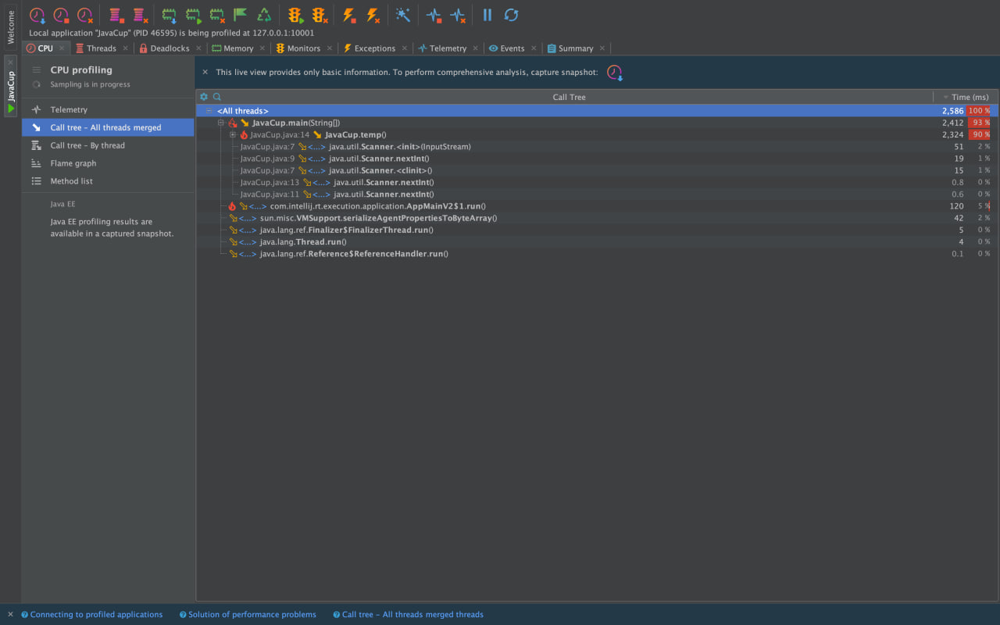
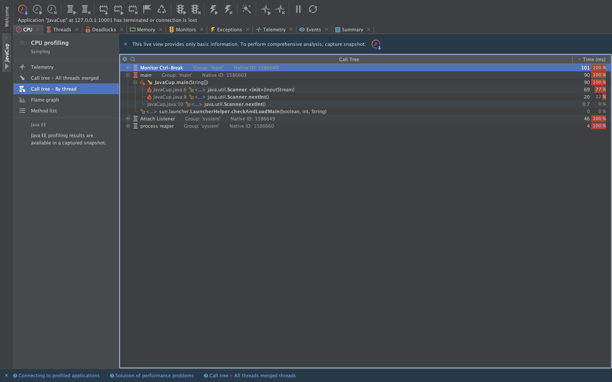
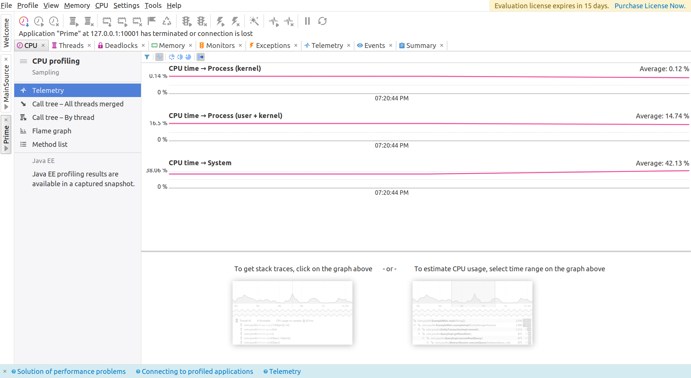
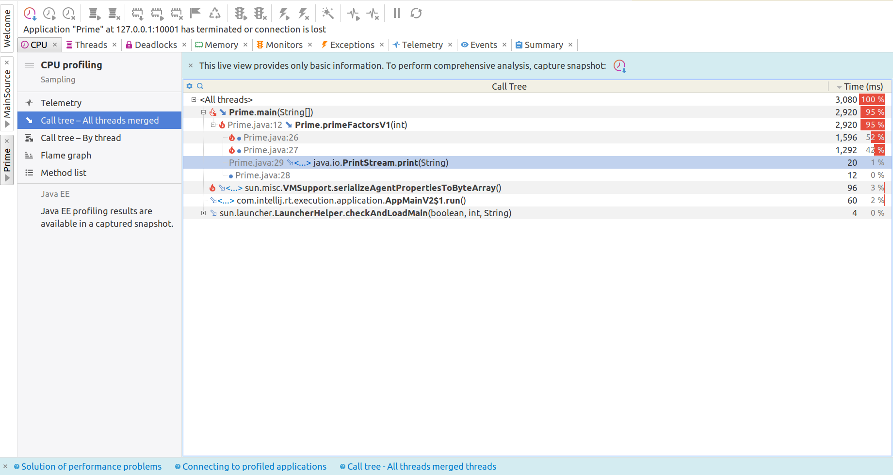
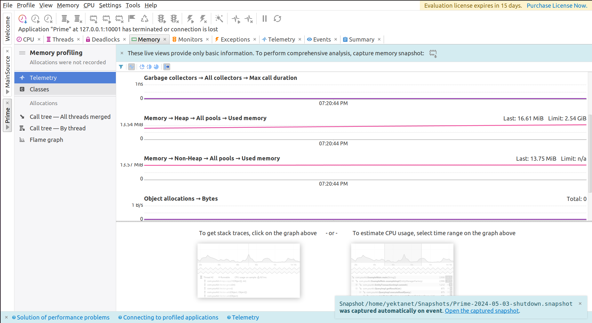
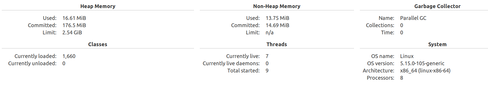
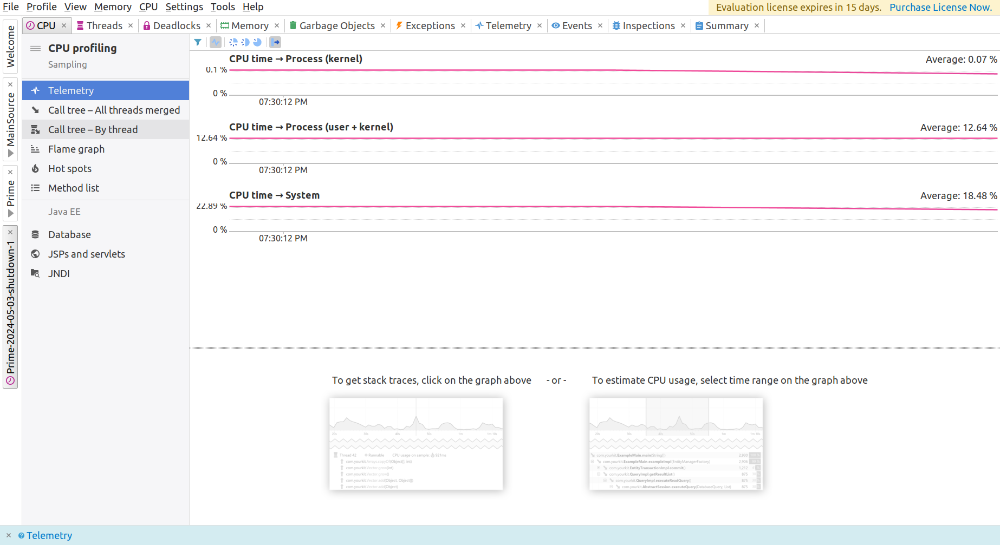
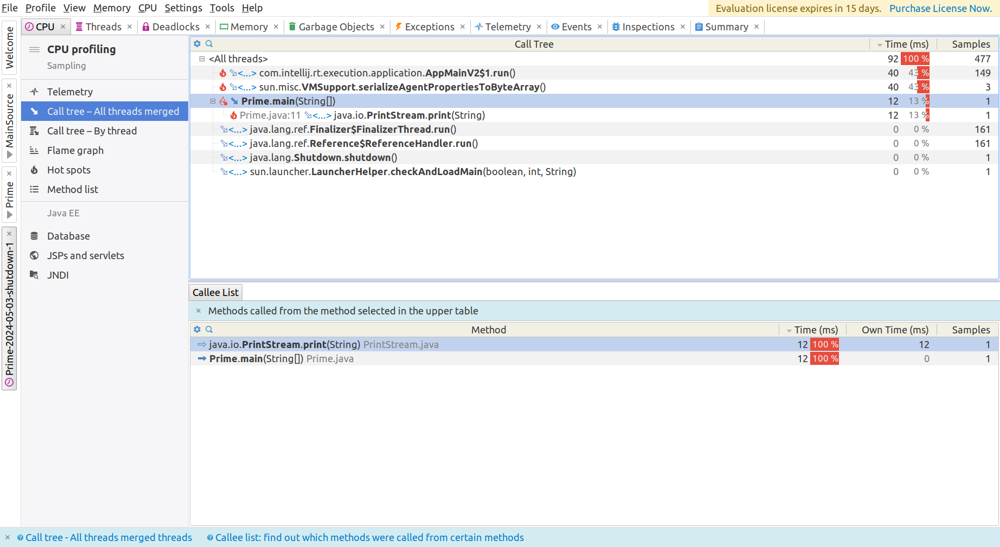
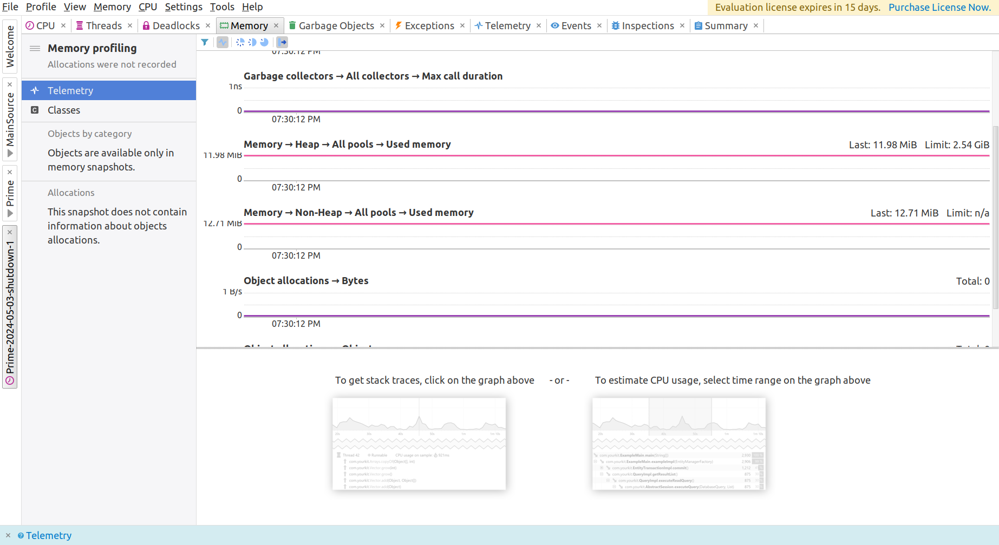
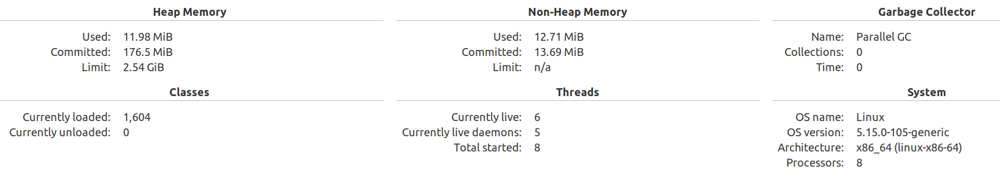

# SE-Lab-Profiling

<h2>
بخش اول
</h2>
طبق عکس زیر مشخص است که تابع
<code>temp</code>
بیشترین میزان مصرف منابع را دارد.

از آن‌جا که این تابع کمکی به روند پیشبرد برنامه اصلی JavaCup نمی‌کند. بودن یا نبودنش فرقی نمی‌کند و می‌توان آن را حذف کرد. در این صورت اجرای برنامه بسیار سریع‌تر می‌شود.

عکس بعد اجرا بعد از حذف:

توجه کنید که بعد عکس اول در لحظه‌های اولیه اجرا عکس‌برداری شده است و برنامه در آن لحظه تمام نشده است.

## بخش دوم 

در این بخش الگوریتمی برای نمایش عوامل اول یک عدد پیاده‌سازی کرده‌ایم.

الگوریتم اولیه منابع نسبتا زیادی را مصرف می‌کند و همچنین زمان اجرای آن زیاد است. 
برای بررسی مشکلات موجود پروفایلینگ را اجرا می‌کنیم که نتایج آن در ادامه آمده است:

یا توجه به مصرف زیاد منابع توسط تابع primeFactorsV1 باید الگوریتم آن را به گونه‌ای تغییر دهیم که منابع کمتری نیاز داشته باشد. پس از تغییر کد و بهینه‌سازی آن به نتایج زیر میرسیم:

در این حالت تابع primeFactorsV2 استفاده شده است.

 