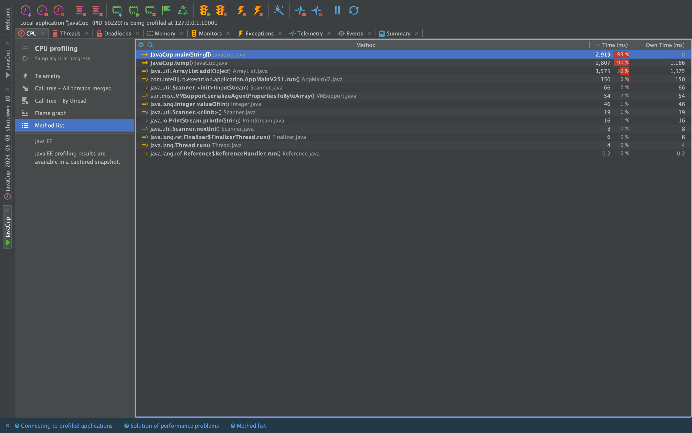
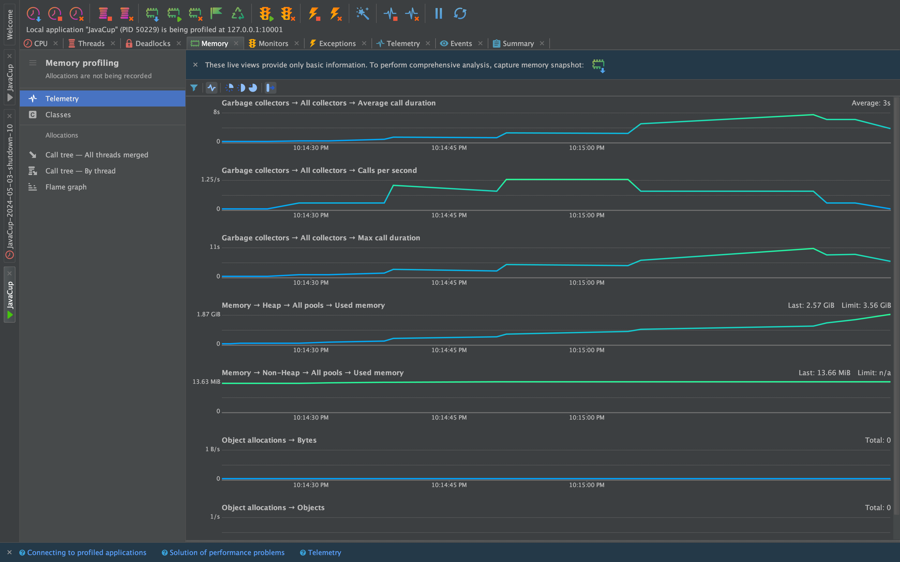
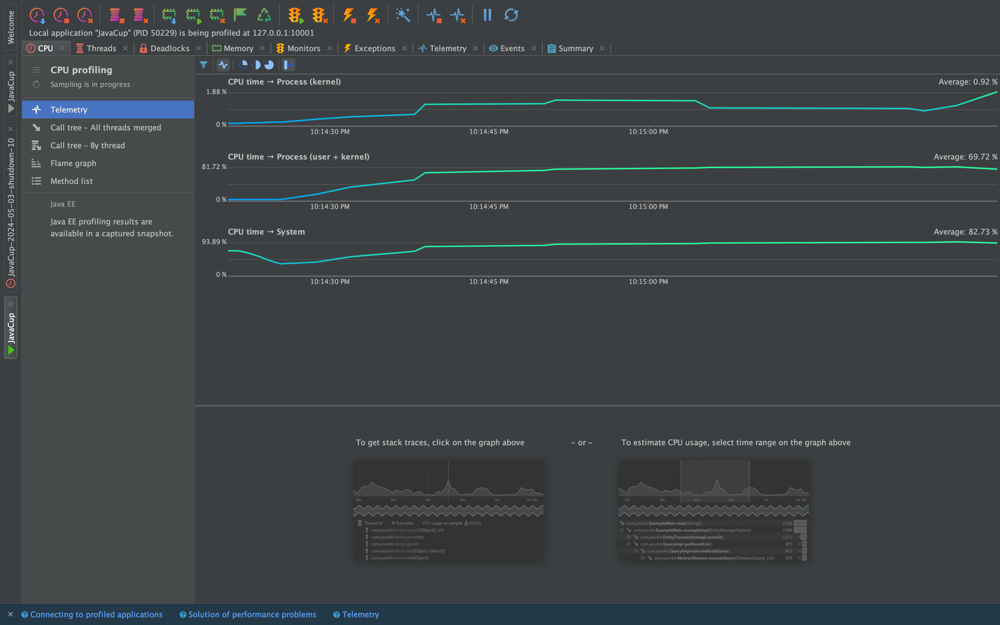
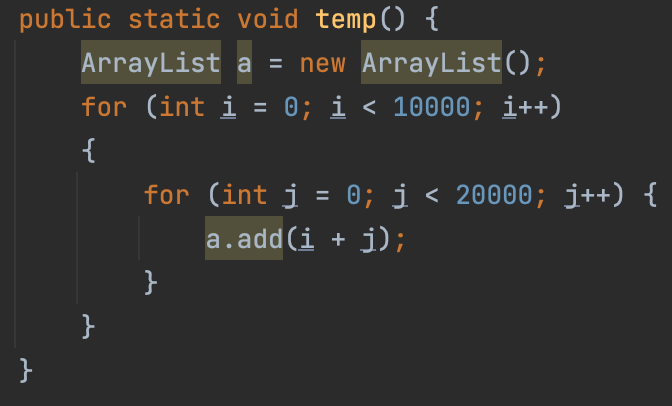
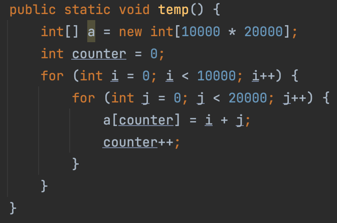
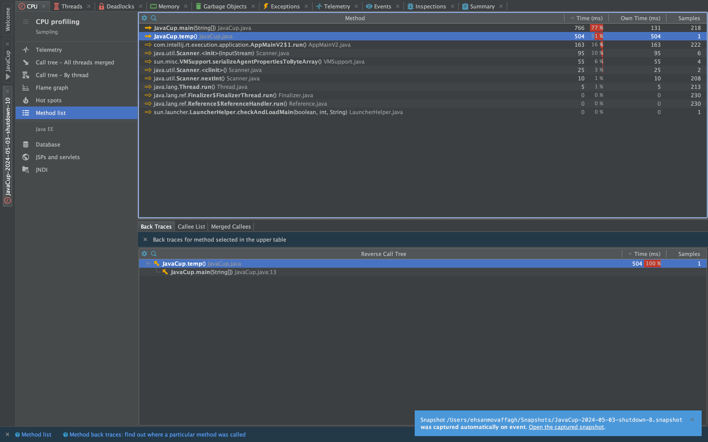
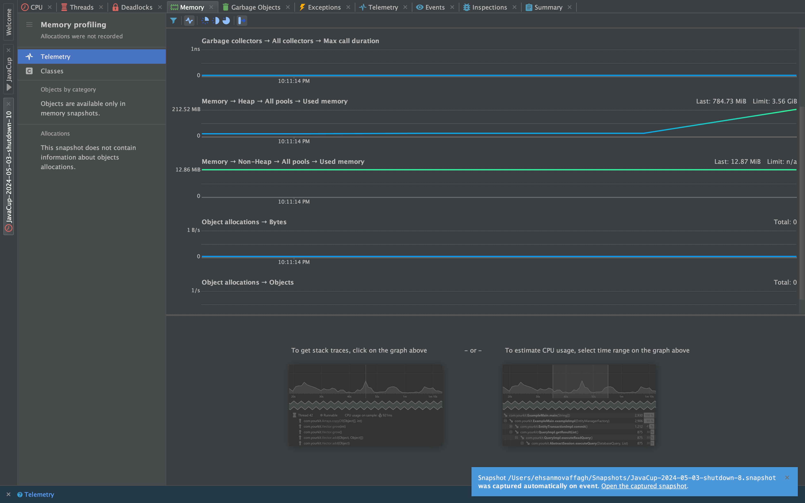
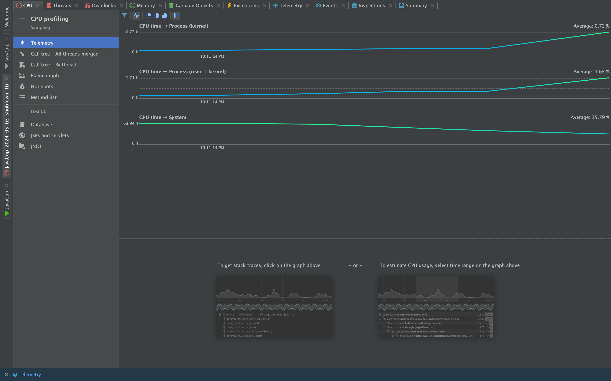

# SE-Lab-Profiling

<h2>
بخش اول
</h2>
طبق عکس زیر مشخص است که تابع
<code>temp</code>
بیشترین میزان مصرف منابع را دارد.

باقی عکس‌ها برای مصرف کلی منابع توسط این برنامه هستند:

به جای استفاده از 
<code>ArrayList</code>
ما از آرایه استاتیک از پیش تریف شده در تابع 
<code>temp</code>
استفاده می‌کنیم. از این رو سرعت اجرای برنامه بهبود پیدا می‌کند و همچنین برنامه مموری کمتری استفاده می‌کند.

کد قبلی:

کد جدید:

عکس بعد اجرا بعد از حذف:

باقی عکس‌ها برای مصرف کلی منابع توسط این برنامه هستند:

توجه کنید که بعد عکس اول در لحظه‌های اولیه اجرا عکس‌برداری شده است و برنامه در آن لحظه تمام نشده است.
زیرا برنامه در حالت قبل از تغییر خیلی دیر تمام می‌شود.
در صورت کلی نیز بدیهی است که میزان مصرف منابع پس از تغییر به میزان قابل توجهی چه در زمینه CPU و چه در زمینه Memory کاهش چشمگیری داشته است.

## بخش دوم 

در این بخش الگوریتمی برای نمایش عوامل اول یک عدد پیاده‌سازی کرده‌ایم.

الگوریتم اولیه منابع نسبتا زیادی را مصرف می‌کند و همچنین زمان اجرای آن زیاد است. 
برای بررسی مشکلات موجود پروفایلینگ را اجرا می‌کنیم که نتایج آن در ادامه آمده است:

یا توجه به مصرف زیاد منابع توسط تابع primeFactorsV1 باید الگوریتم آن را به گونه‌ای تغییر دهیم که منابع کمتری نیاز داشته باشد. پس از تغییر کد و بهینه‌سازی آن به نتایج زیر میرسیم:

در این حالت تابع primeFactorsV2 استفاده شده است.

همان‌طور که مشاهده می‌شود منابع به صورت زیر کاهش پیدا کرده‌اند:

 

Heap Memory: 16.61 -> 11.98 MiB

Heap Memory: 13.75 -> 12.71 MiB

Executing Time: 3080 -> 92 ms
